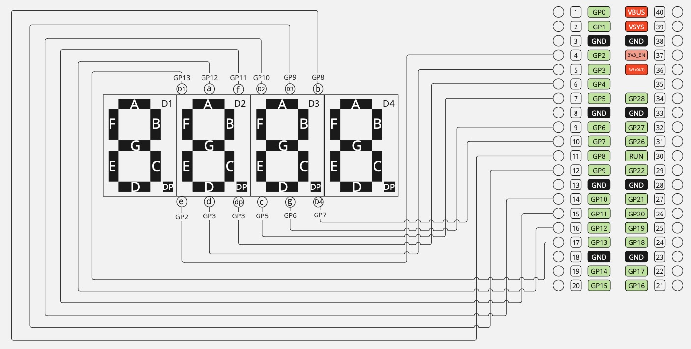

# RP2040 Embassy

This example will show the numbers from `000` to `999` with `A.` prefix on a loop.
The display should show:

```
A.000
A.001
A.002
(...)
A.009
A.010
A.011
(...)
A.099
A.100
A.101
(...)
A.999
A.000
(...)
```

## Components

- 3461BS 4-Digit 7-Segment Display
- Raspberry Pi Pico

### Connections


