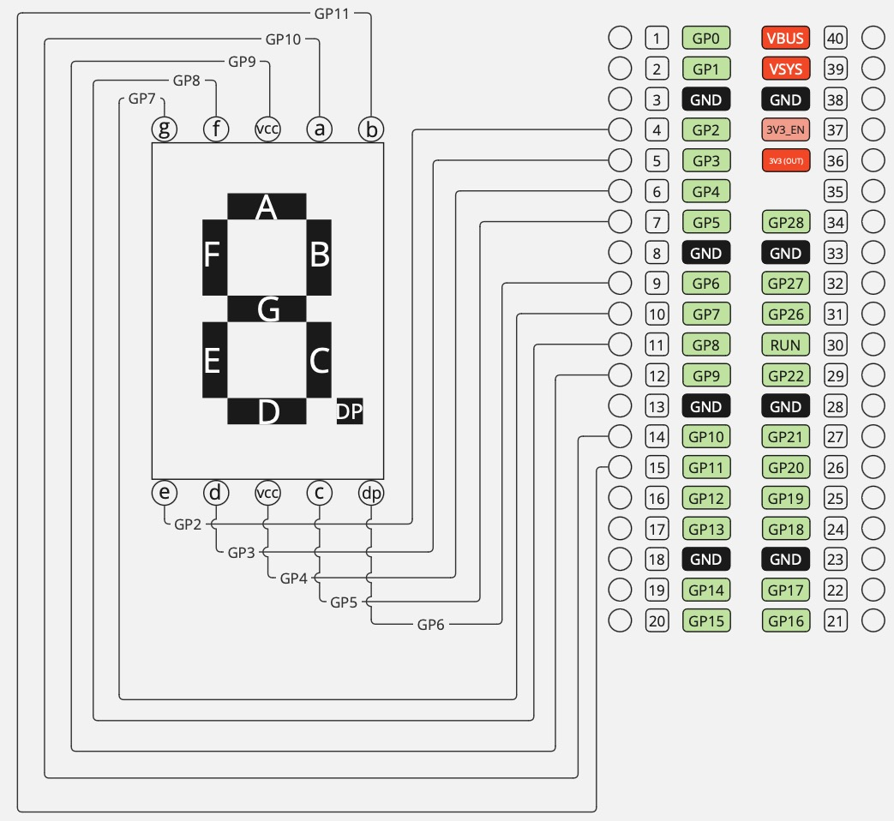

# RP2040 Embassy

This example will show the numbers from 0 to 9 on a loop. Every other loop
the dot (`dp`) will be toggled.

## Components

- 5161BS 7-Segment Display
- Raspberry Pi Pico

### Connections

